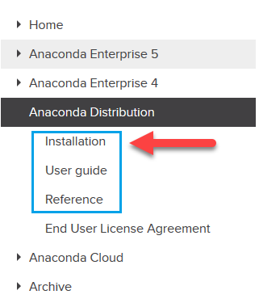
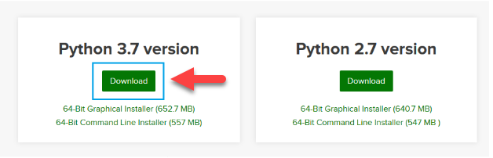
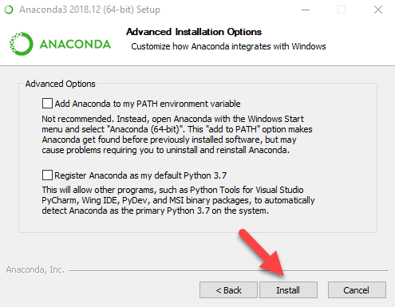
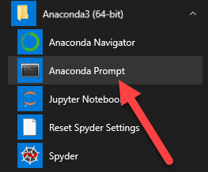
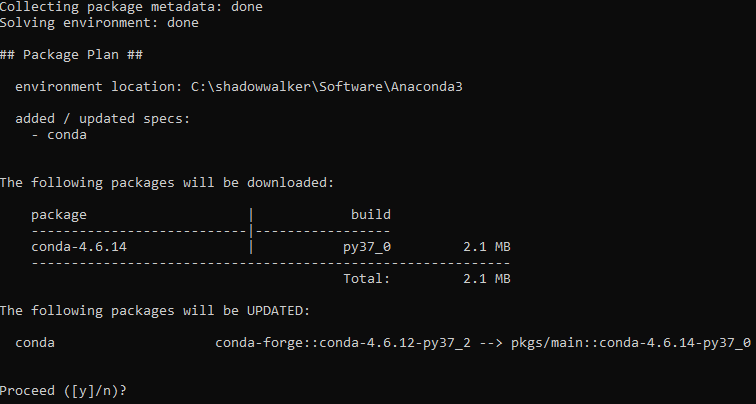
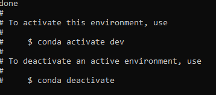

## Anaconda Environment Setup

This guide walks through the installation and configuration process for an Anaconda environment. This guide includes the following:

* Download and installation of Anaconda distribution for Python 3

* Configuration of Anaconda dev virtual environment

* Activation of Anaconda dev environment

* Installation of JupyterLab

### Download and Install Anaconda

1. Navigate to the Anaconda installation [documentation](https://docs.anaconda.com/anaconda/install/). It will be valuable to have the documentation available in case any issues arise.

    

2. Navigate to the Anaconda download site, which can be found [here](https://www.anaconda.com/distribution/#windows). Scroll to the bottom and select the Python 3.7 download.

    

3. You will be asked to save the installer. Save it. After the download is complete, run the download file. This will launch an installation wizard that will walk you through the Anaconda install. Continue through the installation process by clicking either "I Agree" or "Next."

    

4. You will eventually get to a screen that asks if you would like to set your PATH environment variable using the installation wizard. Do NOT check this box. Make sure that both boxes are unchecked, as displayed in the below screenshot. Click `install`.

    

5. Click Finish once the installation is complete.

6. Use the Applications folder (Mac) or Start menu (Windows) to open the Anaconda terminal.

    

7. Execute the following commands to ensure the latest Anaconda packages are installed. When prompted, enter "y" to proceed.

    ```shell
    conda update conda
    conda update anaconda
    ```

    

8. Create a dev environment. When prompted, enter "y" to proceed.

    ```shell
    conda create -n dev python=3.7 anaconda
    ```

    

9. Activate the dev environment.

    ```shell
    conda activate dev
    ```

    

10. Verify your your installations by executing the `conda list` command after activating the environment, then locating the following packages in the populated list:

    - Numpy
    - Pandas
    - Matplotlib

11. After the installation of Anaconda,  we'll want to enable the terminal commands. The instructions differ by your operating system.

* [Windows](https://codingbootcamp.hosted.panopto.com/Panopto/Pages/Viewer.aspx?id=93a9c967-71b2-434c-bcda-ab7a011f5c9c). After these instructions, you need to open your terminal and run `conda init bash`. Then close your terminal, and start a new one before using any `jupyter` command.

* [Mac](https://codingbootcamp.hosted.panopto.com/Panopto/Pages/Viewer.aspx?id=1c0d69d6-523c-4275-86a5-ab7a011f370a). Versions of MacOS 10.15 and beyond (Catalina) will need to run `conda init zsh` in the terminal after these steps. Versions below 10.15 will need to run `conda init bash` instead.

A few other things to look out for during the post-installation:

* Note that the exact location where your Anaconda folder is installed may differ based upon your operating system, version of operating system, and version of Anaconda. It is not uncommon to need to search for the "anaconda3" directory on your machine.

* If you're having trouble locating the installation directory for Anaconda, try right-clicking the shortcut for anaconda-navigator and going to Properties (Windows) or Get Info (MacOS). The shourtcut should have a reference to the directory containing Anaconda.

* If you're  using a Windows machine, and running `jupyter-lab .` creates an error involving "can't find jupyter module", make sure that you have gone through the steps for `conda init bash`.
