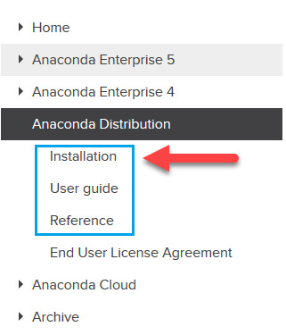
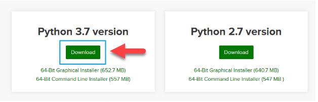
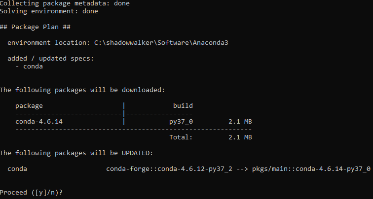
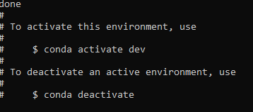
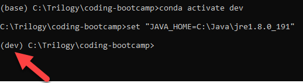

## Anaconda Environment Setup

This guide walks through the installation and configuration process for an Anaconda environment. This guide includes the following:

* Download and installation of Anaconda distribution for Python 3

* Configuration of Anaconda dev virtual environment

* Activation of Anaconda dev environment

* Installation of JupyterLab

### Download and Install Anaconda

1. Navigate to the Anaconda installation [documentation](https://docs.anaconda.com/anaconda/install/). It will be valuable to have the documentation available in case any issues arise.

    

2. Navigate to the Anaconda download site, which can be found [here](https://www.anaconda.com/distribution/#windows). Scroll to the bottom and select the Python 3.7 download.

    

3. You will be asked to save the installer. Save it. After the download is complete, run the download file. This will launch an installation wizard that will walk you through the Anaconda install. Continue through the installation process by clicking either "I Agree" or "Next."

    

4. You will eventually get to a screen that asks if you would like to set your PATH environment variable using the installation wizard. Do NOT check this box. Make sure that both boxes are unchecked, as displayed in the below screenshot. Click `install`.

    

5. Click Finish once the installation is complete.

6. Use the Applications folder (Mac) or Start menu (Windows) to open the Anaconda terminal.

    

7. Execute the following commands to ensure the latest Anaconda packages are installed. When prompted, enter "y" to proceed.

    ```shell
    conda update conda
    conda update anaconda
    ```

    

8. Create a dev environment. When prompted, enter "y" to proceed.

    ```shell
    conda create -n dev python=3.7 anaconda
    ```

    

9. Activate the dev environment.

    ```shell
    conda activate dev
    ```

    
