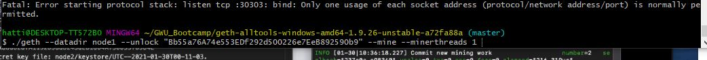
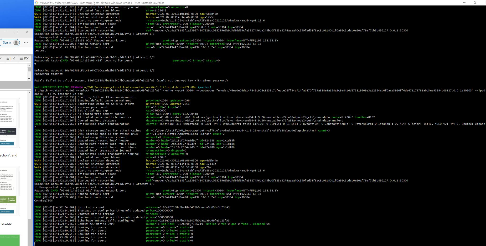

# Blockain Module 18 

## Background Criteria 
### Set up and Testing
As part of the homework I set out to establish a custom out-of-the-box blockchain. 

As a result I created two nodes utilizing GitBash to link into my Blockchain-Tools folder to retrieve the geth function. 
Utilizing geth I a created the two new node accounts. I was successful to generate both the public key and secret keys for both nodes. 

#### Node 1
Public address of the key:   0x3e7BE85d010E292F3ceF1D391455cB3E76491c6f
Path of the secret key file: node1\keystore\UTC--2

#### Node 2
Public address of the key:   0xc0c11695c7d2054611A37EBB20EE8D610343b990
Path of the secret key file: node2\keystore\UTC--2

From here I had to set up puppeth in order to create a new genisis block. 

### Creating my Genisis from scratch running puppet and creating a puppernet2 file: 

Please specify a network name to administer (no spaces, hyphens or capital letters please)
> puppernet2

Sweet, you can set this via --network=puppernet2 next time!

INFO [02-18|13:52:58.226] Administering Ethereum network           name=puppernet2
WARN [02-18|13:52:58.229] No previous configurations found         path=C:\\Users\\hatti\\.puppeth\\puppernet2

### Below is where I’m configuring the new Genisis by running through the options below. 
What would you like to do? (default = stats)
 1. Show network stats
 2. Configure new genesis
 3. Track new remote server
 4. Deploy network components
> 2

What would you like to do? (default = create)
 1. Create new genesis from scratch
 2. Import already existing genesis
> 1

Which consensus engine to use? (default = clique)
 1. Ethash - proof-of-work
 2. Clique - proof-of-authority
> 1

### After establishing the above I have gone to my MyCrypto account to obtain an Account Address. I have then funded my account with the recommended 1 wei. 

Which accounts should be pre-funded? (advisable at least one)
> 0x0D590f3248a183318996D002fBC755Bd9807aE7F
> 0x

Should the precompile-addresses (0x1 .. 0xff) be pre-funded with 1 wei? (advisable yes)
>

### Below I established the number for the chain ID:

Specify your chain/network ID if you want an explicit one (default = random)
> 333
INFO [02-18|14:04:45.856] Configured new genesis block

What would you like to do? (default = stats)
 1. Show network stats
 2. Manage existing genesis
 3. Track new remote server
 4. Deploy network components

What would you like to do? (default = stats)
 1. Show network stats
 2. Manage existing genesis
 3. Track new remote server
 4. Deploy network components
> 2

 1. Modify existing configurations
 2. Export genesis configurations
 3. Remove genesis configuration
> 2

Which folder to save the genesis specs into? (default = current)
  Will create puppernet2.json, puppernet2-aleth.json, puppernet2-harmony.json, puppernet2-parity.json
>
INFO [02-18|14:13:25.231] Saved native genesis chain spec          path=puppernet2.json
INFO [02-18|14:13:25.234] Saved genesis chain spec                 client=aleth path=puppernet2-aleth.json
INFO [02-18|14:13:25.236] Saved genesis chain spec                 client=parity path=puppernet2-parity.json
INFO [02-18|14:13:25.238] Saved genesis chain spec                 client=harmony path=puppernet2-harmony.json

### In order to run the transaction I had go back a directory to my Blockain Tools in order to generate new akeys for my transactions which I did for both nodes. 

hatti@DESKTOP-TT572B0 MINGW64 ~/GWU_Bootcamp/Blockchain-Tools (master)
$ ^C

hatti@DESKTOP-TT572B0 MINGW64 ~/GWU_Bootcamp/Blockchain-Tools (master)
$ ./geth account new --datadir node1
INFO [02-18|14:20:52.622] Maximum peer count                       ETH=50 LES=0 total=50
Your new account is locked with a password. Please give a password. Do not forget this password.
!! Unsupported terminal, password will be echoed.
Password: -------
Repeat password: ------

Your new key was generated
Public address of the key:   0xBbCa4Cf0EbB3B8e8Bdf79C0895484F67A9329303
Path of the secret key file: node1\keystore\UTC--20

hatti@DESKTOP-TT572B0 MINGW64 ~/GWU_Bootcamp/Blockchain-Tools (master)
$ ./geth account new --datadir node2
INFO [02-18|14:23:14.036] Maximum peer count                       ETH=50 LES=0 total=50
Your new account is locked with a password. Please give a password. Do not forget this password.
!! Unsupported terminal, password will be echoed.
Password: C------
Repeat password: ------

Your new key was generated
Public address of the key:   0xDc6aCdC72ea8Bfb69d2621E90a02Ad8c29808433
Path of the secret key file: node2\keystore\UTC--2

It would appear that my establish my mining was successful based on the screenshot from GitBash. 

### Coding Conventions/Formatting

• Appropriate header, name, short description at top of the notebook
• Imports are at the top of the file, just after any headers or subheads.
• Files read in from relative file path
• Functions and variable names are descriptive, lowercase, with words separated by underscores
• Clean code, no repetition, maintainable and highly reusable code.
• Appropriate code wrapping and cell sizes
• Appropriate subheads as needed

### Deployment/Submission

.• Files submitted in personal repo
• Appropriate directory structure with correct files needed to run scripts
• Appropriate commit messages
• Appropriate README

### Documentation/Comments
• Code is well commented with concise, relevant comments