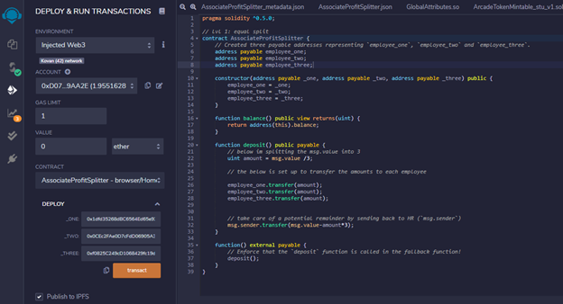
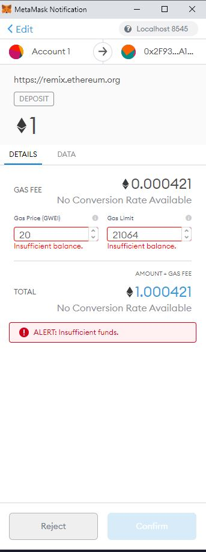
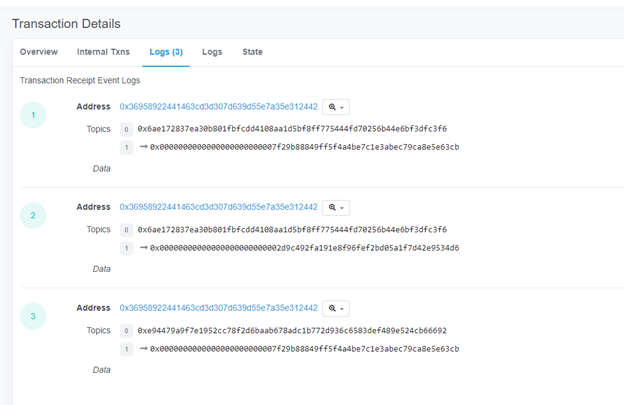

# Unit 20 Homework - "Looks like we've made our First Contract!"

## Background

In this homework module I had to develop a Ethereum-compatible blockchain to help connect financial institutions. Utilizing smart contracts to automate some company finances in order to, increase transparency, and to make accounting and auditing automatic!

Using Solidity! I set out to create 3 `ProfitSplitter` contracts. To assist in:

* Paying Associate-level employees quickly and easily.

* Distribute profits to different tiers of employees.

* Distribute company shares for employees in a "deferred equity incentive plan" automatically.

## Contract Setpup

* **Level One** is an `AssociateProfitSplitter` contract. This will accept Ether into the contract and divide the Ether evenly among the associate level employees. This will allow the Human Resources department to pay employees quickly and efficiently.

* **Level Two** is a `TieredProfitSplitter` that will distribute different percentages of incoming Ether to employees at different tiers/levels. For example, the CEO gets paid 60%, CTO 25%, and Bob gets 15%.

### Contract Functionality

Using [Remix IDE](https://remix.ethereum.org) I created a new contract called `AssociateProfitSplitter.sol` using the starter code for level one provided.

While developing and testing I used the [Ganache](https://www.trufflesuite.com/ganache) development chain, and pointed my MetaMask to `localhost:8545`.

### Level One: The `AssociateProfitSplitter` Contract

At the top of the contract, I defined the following `public` variables:

* `employee_one` -- The `address payable` of the first employee. I did the same for * `employee_two`  and * `employee_three` ensuring the associates are all represented and that they will be paid.

Creating the constructor function accepts:

* `address payable _one`
* `address payable _two`
* `address payable _three`

Within the constructor, I set the employee addresses to equal the parameter values. 
Avoiding the need to hardcode the employee addresses.

Next, I created:

* `balance` -- setting it to `public view returns(uint)`, returning the contract's current balance. 
*  `deposit` -- This function should set to `public payable` check, to ensure only the owner can call the function.

  * In this function, I followed the below steps:

    * Set a `uint amount` to equal `msg.value / 3;` to calculate the split value of the Ether.
    * Transfer the `amount` to `employee_one`.
    * Repeating the steps for `employee_two` and `employee_three`.

To avoid any wei from being discarded I had to do the following to ensure any leftover wei is returned back to HR:

* Transfer the `msg.value - amount * 3` back to `msg.sender`.

* To avoid Ether being locked in the contract I needed to create a fallback function using `function() external payable`, and call the `deposit` function from within it. 

#### Test the contract

To test the contract I initiated the `Deploy` tab in Remix, using the local Ganache chain by connecting to `Injected Web3` and pointing my MetaMask to `localhost:8545`.

### Level Two: The `TieredProfitSplitter` Contract

In this contract, rather than splitting the profits between Associate-level employees, I needed to calculate percentages for different tiers of employees (CEO, CTO, and Bob).

Using the starter code provided, I performed the following:

* Calculate the number of points/units by dividing `msg.value` by `100`.

  * Allowing me to multiply the points with a number representing a percentage. For example, `points * 60` will output a number that is ~60% of the `msg.value`.

* The `uint amount` variable will be used to store the amount to send each employee temporarily. For each employee, I set the `amount` to equal the number of `points` multiplied by the percentage.

* After calculating the `amount` for the first employee, add the `amount` to the `total` to keep a running total of how much of the `msg.value` we are distributing so far.

* Then, transfer the `amount` to `employee_one`. Repeating the steps for each employee.

* Below is the screenshot from Remix showing how the above was compiled. 

* Send the remainder to the employee with the highest percentage by subtracting `total` from `msg.value`, and sending that to an employee.

* Deploy and test the contract functionality by depositing various Ether values (greater than 100 wei).

### Deploy the contracts to a live Testnet

Once you feel comfortable with your contracts, point MetaMask to the Kovan or Ropsten network. Ensure you have test Ether on this network!

After switching MetaMask to Kovan, deploy the contracts as before and copy/keep a note of their deployed addresses. The transactions will also be in your MetaMask history, and on the blockchain permanently to explore later.

## Submission

1. `README.md` that explains how each of the contracts work and what the motivation for each of the contracts is. 
2. Sreenshots to illustrate the functionality

