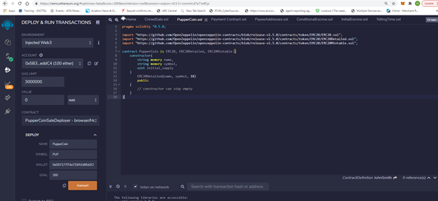
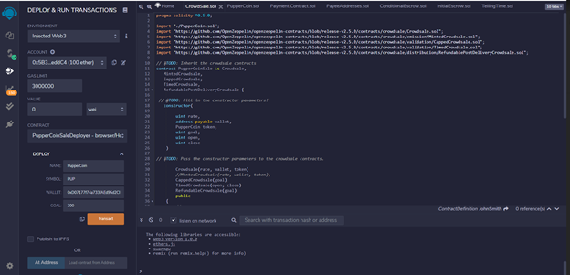
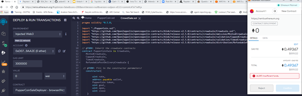
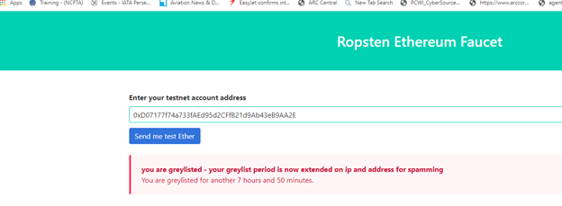

# HomeWork Unit 21: Attracting a Crowd

## Background

In this assignment I created a crowdsale contract which required the creation of their PupperCoin token in order to fund the network development, tracking dog breeding activity across the globe in a decentralized way. Allowing humans to track the genetic trail of their pets. Having established all legal requirements I was able to initiate the crowdsale. There was also a need to have a refund process for when the goal of 300 Ether was met after the time period of 24 weeks.

I created an ERC20 token that will be minted through a `Crowdsale` contract leveraging the OpenZeppelin Solidity library.
Which will manage the entire process, allowing users to send ETH and get back PUP (PupperCoin).
This contract will mint the tokens automatically and distribute them to buyers in one transaction.

In order to facilitat this I needed to inherit the following OpenZeppelin contracts `Crowdsale`, `CappedCrowdsale`, `TimedCrowdsale`, `RefundableCrowdsale`, and `MintedCrowdsale`.

### Creating the project

Using Remix, I created a file called `PupperCoin.sol` and create a standard `ERC20Mintable` token, using the [starter code](../Starter-Code/PupperCoin.sol) provided.
And I create a new contract named `PupperCoinCrowdsale.sol`, as a standard crowdsale.

### Designing the contracts

#### PupperCoinCrowdsale

Leveraging the [Crowdsale](../Starter-Code/Crowdsale.sol) starter code, the file was saved to emix as `Crowdsale.sol`.

Where I created parameters for all of the features of the crowdsale, such as the `name`, `symbol`, `wallet` for fundraising, `goal`, etc.

I hardcoded a `rate` of 1, to maintain parity with Ether units (1 TKN per Ether, or 1 TKNbit per wei). I

Since `RefundablePostDeliveryCrowdsale` inherits the `RefundableCrowdsale` contract, which requires a `goal` parameter, had to call the `RefundableCrowdsale` constructor from the`PupperCoinCrowdsale` constructor as well as the others. 

When passing the `open` and `close` times, I used `now` and `now + 24 weeks` to set the times properly from `PupperCoinCrowdsaleDeployer` contract.

### Testing the Crowdsale

As part of my testing I attempted to sent Ether to the crowdsale from a different account. In my initial attempts i have ran into errors the first that i did not have enough funds and the second that I got not get funds from Ropster for another 7 hours.  

